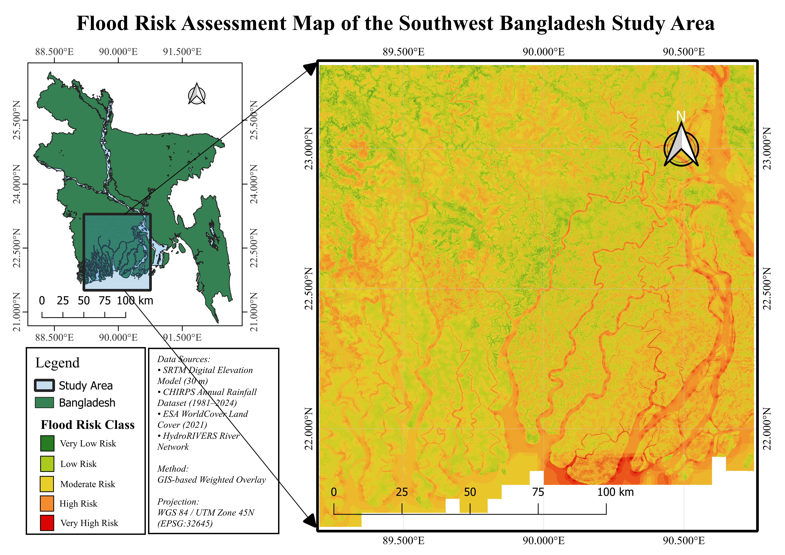

# GIS-Based Flood Risk Assessment of Southwest Coastal Bangladesh Using Multi-Criteria Weighted Overlay Analysis

## Project Overview

This project presents a GIS-based flood risk assessment framework for Southwest Coastal Bangladesh using a multi-criteria weighted overlay approach.

The study integrates topographic, hydrological, climatic, and land-use factors to identify spatial variations in flood susceptibility. Five major flood influencing factors, including elevation, slope, river proximity, rainfall, and land use/land cover (LULC), were analyzed and integrated to generate a final flood risk index and classified flood risk map.

The complete workflow was developed using open-source geospatial technologies, including QGIS, GDAL, and GRASS GIS.

---

# Objectives

The main objectives of this project are:

- To develop individual flood risk layers based on elevation, slope, river proximity, rainfall, and land use/land cover.
- To preprocess and standardize multiple spatial datasets for flood susceptibility assessment.
- To integrate different flood controlling factors using GIS-based weighted overlay analysis.
- To generate a final flood risk index representing spatial flood susceptibility.
- To develop a classified flood risk map for supporting flood management and spatial planning.

---

# Study Area

The study focuses on Southwest Coastal Bangladesh, a region highly vulnerable to flooding due to:

- Low-lying deltaic terrain
- Dense river networks
- Monsoon rainfall influence
- Changing land-use patterns
- Coastal hydrological dynamics

The interaction between topographic, climatic, and hydrological conditions creates complex flood susceptibility patterns across the region.

---

# Data Sources

| Dataset | Source | Application |
|---|---|---|
| Digital Elevation Model (DEM) | SRTM DEM | Elevation and slope analysis |
| Rainfall Dataset | CHIRPS | Rainfall risk assessment |
| Land Use/Land Cover Dataset | ESA WorldCover | LULC risk assessment |
| River Network Dataset | HydroRIVERS | River proximity analysis |
| Boundary Data | Administrative boundary dataset | Study area extraction |

---

# Methodology

The overall workflow consists of:

1. Data collection and preprocessing

2. Projection standardization and study area extraction

3. Raster preparation and alignment

4. Development of individual flood risk layers

5. Risk classification and reclassification

6. Weighted overlay analysis

7. Generation of final flood risk index

8. Flood risk classification and mapping

---

# Flood Risk Factors and Weights

The final flood risk index was calculated using the following weighted overlay model:

Flood Risk Index (FRI) =

(Elevation Risk × 0.25)
+
(River Proximity Risk × 0.25)
+
(Slope Risk × 0.20)
+
(LULC Risk × 0.15)
+
(Rainfall Risk × 0.15)

## Assigned Weights

| Flood Risk Factor | Weight |
|---|---:|
| Elevation Risk | 25% |
| River Proximity Risk | 25% |
| Slope Risk | 20% |
| LULC Risk | 15% |
| Rainfall Risk | 15% |

---

# Software and Tools Used

- QGIS
- GDAL
- GRASS GIS
- Raster Calculator
- Raster Reclassification
- Weighted Overlay Analysis

---

# Final Outputs

The project generated the following outputs:

## Maps

- Flood Risk Assessment Components Map
- Final Flood Risk Assessment Map

## Raster Outputs

- Final Flood Risk Index Raster
- Final Flood Risk Classification Map

## Statistical Outputs

- Flood Risk Class Area Distribution Table

---

# Flood Risk Classification

The final flood susceptibility map was classified into five categories:

| Class | Risk Level |
|---|---|
| 1 | Very Low Risk |
| 2 | Low Risk |
| 3 | Moderate Risk |
| 4 | High Risk |
| 5 | Very High Risk |

---

# Results Summary

The final flood risk assessment identified spatial variations in flood susceptibility across the study area.

The flood risk distribution shows:

| Flood Risk Class | Area (%) |
|---|---:|
| Very Low Risk | 0.66% |
| Low Risk | 19.50% |
| Moderate Risk | 44.24% |
| High Risk | 32.24% |
| Very High Risk | 3.36% |

Moderate and High Risk zones represent the dominant flood susceptibility categories, indicating considerable flood vulnerability within the study area.

---

# Final Maps

## Flood Risk Components Map

## Final Flood Risk Assessment Map

---

# Repository Structure

GIS-Flood-Risk-Assessment-Southwest-Bangladesh

│
├── README.md
│
├── 01_QGIS_Project
│
├── 02_Final_Maps
│
├── 03_Final_Results
│
├── 04_Risk_Factors
│
├── 05_Report
│
├── Flood_Risk_Components_Map.png
│
├── Flood_Risk_Final_Map.png
│
└── Flood_Risk_Class_Area.csv

---

# References

- Farr, T. G., et al. (2007). The Shuttle Radar Topography Mission. *Reviews of Geophysics, 45*(2).

- Funk, C., et al. (2015). The climate hazards infrared precipitation with stations (CHIRPS). *Scientific Data, 2*, 150066.

- Zanaga, D., et al. (2022). ESA WorldCover 10 m 2021 v200.

- Lehner, B., & Grill, G. (2013). Global river hydrography and network routing. *Hydrological Processes, 27*(15), 2171–2186.

---

# Author

Sujoy Biswas

GIS-Based Flood Risk Assessment Project

Southwest Coastal Bangladesh
